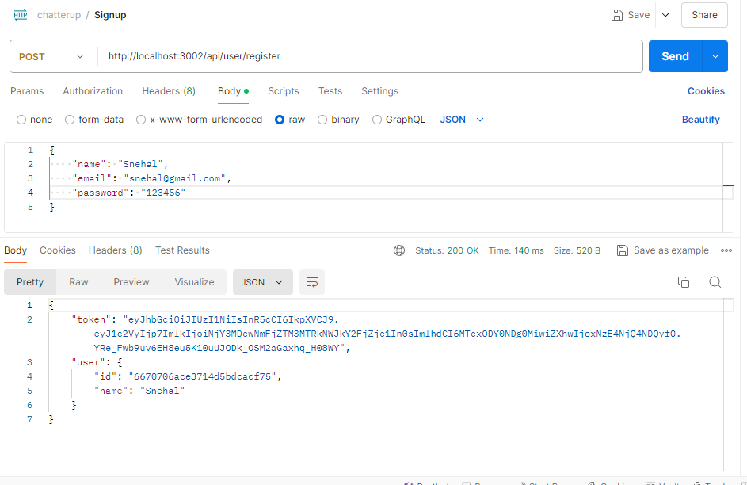
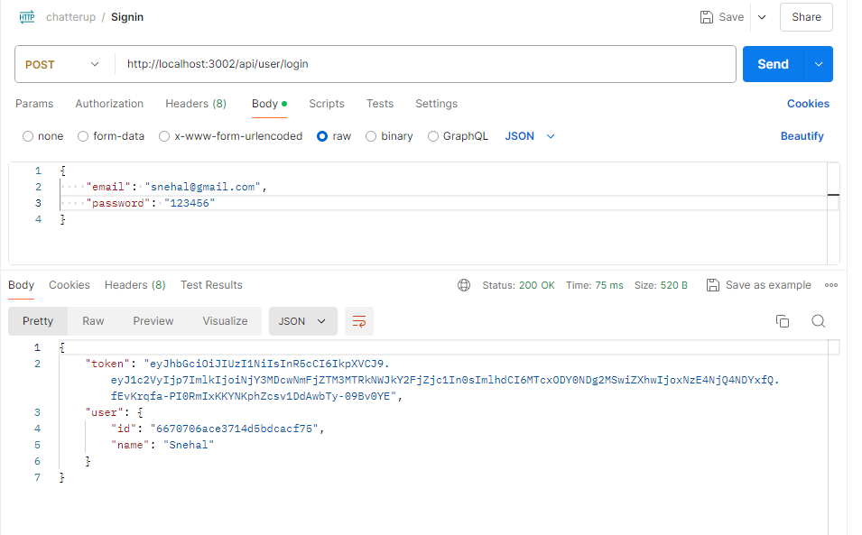
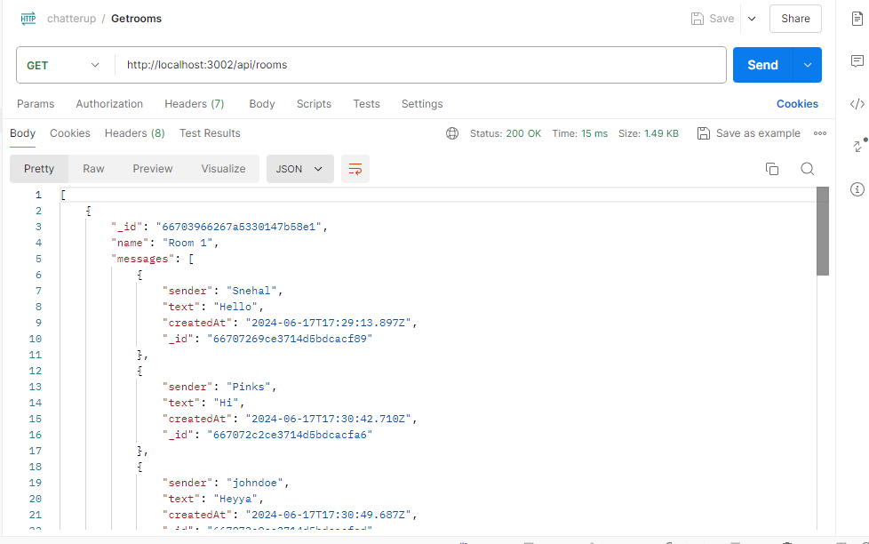
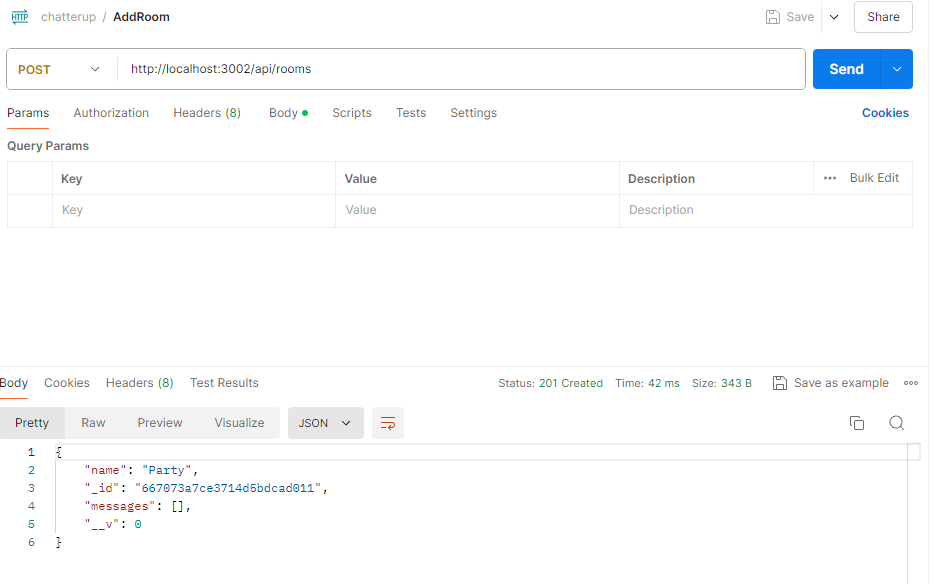
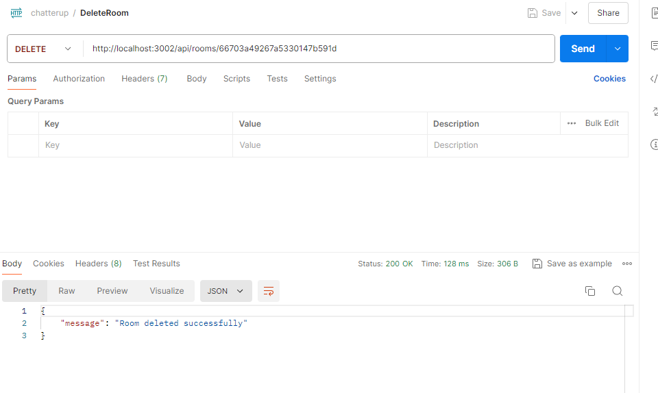

# Chatter Up (Backend )

This is a backend application for a real-time chat system built with Express.js, Socket.io, and MongoDB.

## Snapshots

- **Signup Route**



- **Signin Route**



- **Get Rooms**



- **Add Room**



- **Delete Room**



## Installation

To run this project locally, follow these steps:

1. Clone the repository.
2. Navigate to the project directory:
3. Install the necessary dependencies:

```
npm install
```

4. Set up environment variables.

```
PORT=3002
MONGODB_URI=mongodb://localhost:27017/chatapp
JWT_SECRET=your_jwt_secret_here

```

5. Run the project.

```
node server.js
```

6. The server will start running on http://localhost:3002.

## Routes

## Register a new user

- **URL:** `/api/user/register`
- **Method:** `POST`
- **Body:**

  ```json
  {
    "name": "John Doe",
    "email": "john.doe@example.com",
    "password": "password"
  }
  ```

- **Description:** Registers a new user with the provided name, email, and password.

## Login user

- **URL:** `/api/user/login`
- **Method:** `POST`
- **Body:**

  ```json
  {
    "email": "john.doe@example.com",
    "password": "password"
  }
  ```

- **Description:** Logs in an existing user with the provided email and password, returning a JWT token for authentication.

## Rooms Routes

### Create a new room

- **URL:** `/api/rooms`
- **Method:** `POST`
- **Body:**

  ```json
  {
    "name": "Room Name"
  }
  ```

- **Description:** Creates a new chat room with the specified name.

### Get all rooms

- **URL:** /api/rooms
- **Method:** GET
- **Description:** Retrieves a list of all chat rooms.

### Delete a room

- **URL:** /api/rooms/:id
- **Method:** DELETE
- **Params:** id - The ID of the room to delete.
- **Description:** Deletes the chat room with the specified ID.

# Socket.io Events

## Client-to-Server Events

### Event: `join`

- **Description:** Allows a user to join a specific chat room.

### Event: `sendMessage`

- **Description:** Sends a message to a specific chat room.

### Event: `typing`

- **Description:** Notifies other users in the chat room that someone is typing.

### Event: `stopTyping`

- **Description:** Notifies other users in the chat room that someone has stopped typing.

## Server-to-Client Events

### Event: `roomData`

- **Description:** Sends the details of a room to a client upon joining.

### Event: `message`

- **Description:** Broadcasts a new message to all clients in a room.

### Event: `typing`

- **Description:** Informs clients in a room that a user is typing.

### Event: `stopTyping`

- **Description:** Informs clients in a room that a user has stopped typing.

## Technologies Used

- Node JS
- Express.js
- Socket.io
- MongoDB

## Authors

- [@Snehal](https://github.com/Snehal-Salvi)
